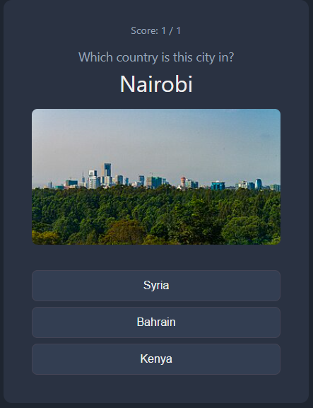

# Guess the Country

A tiny geography quiz game written in Go. You're shown a city and three
country options and you just pick the one it's actually in. Score is tracked as you go.

**Try it live:** [starter-397431207380.us-central1.run.app](https://starter-397431207380.us-central1.run.app/)
. This is the Cloud Run instance kept up to date by the deploy pipeline
below, so it always reflects the latest `main`.



## How it works

The app is a single Go binary (`citycountrygame`) that serves a small
server-rendered game with no JavaScript or client-side framework. Every
interaction is a plain HTTP form post.

- **Game data** ([capitals.go](capitals.go)) — on startup, the app fetches the
  full list of countries and capitals from the
  [countriesnow.space](https://countriesnow.space) API, dropping entries with
  no capital and de-duplicating by city name.
- **Question generation** ([game.go](game.go)) — each round, `NewQuestion`
  picks a random capital as the correct answer, then samples two more
  capitals from *different* countries as distractors, and shuffles the three
  options.
- **City photos** ([images.go](images.go)) — a thumbnail for the question's
  city is pulled from the Wikipedia REST summary API on first use and cached
  in memory (`ImageCache`), so repeat questions about the same city don't
  re-fetch it.
- **HTTP handlers** ([main.go](main.go)) — `GET /` renders a question via the
  `question.html.tmpl` template; the score so far is threaded through the URL
  query string. `POST /answer` receives the chosen option as a form post,
  compares it to the correct answer, and renders `result.html.tmpl` with the
  verdict and an updated score, which then links back to the next question.
- **Templates** ([templates/](templates)) — plain `html/template` files
  embedded into the binary via `go:embed` ([templates.go](templates.go)), so
  the built binary has no external file dependencies.
- **Version endpoint** ([server.go](server.go)) — `GET /version` returns the
  build's version (a git short SHA in production, `dev` locally), used by the
  deployment pipeline to confirm what's actually running.

There's no database and no session/cookie state. The score simply round-trips
through the page's links and forms, which keeps the server fully stateless.

### Running locally

```bash
go run .
```

The server listens on `:8080` by default (override with `PORT`). Open
`http://localhost:8080` to play.

## GitHub Actions pipeline

Every push and pull request runs through a single CI/CD workflow
([.github/workflows/pipeline.yml](.github/workflows/pipeline.yml)) with five
stages that gate each other:

1. **test** — sets up Go using the version pinned in `go.mod` and runs
   `go test ./...`.
2. **security-scan** — runs [Snyk](https://snyk.io) against the Go code
   (`snyk code test`) and pushes a dependency snapshot to the Snyk dashboard
   (`snyk monitor`) for ongoing vulnerability tracking.
3. **docker-build** *(needs: test, security-scan)* — builds the multi-stage
   [Dockerfile](Dockerfile) (compiles a static binary, then copies it into a
   `distroless` non-root base image) and tags the image with the short git
   SHA. On pushes to `main`, the image is also authenticated and pushed to
   Google Artifact Registry; on pull requests, the build runs (to catch
   Docker-level breakage) but nothing is pushed.
4. **deploy** *(needs: docker-build, main-branch pushes only)* — deploys the
   just-built image to Cloud Run using
   `google-github-actions/deploy-cloudrun`, targeting the `prod` GitHub
   Environment.
5. **verify-deployment** *(needs: docker-build, deploy)* — polls the freshly
   deployed service's `/version` endpoint and confirms the running version
   matches the SHA that was just built and deployed, failing the workflow
   loudly if they don't match.

This means every change that reaches `main` is tested, scanned for
vulnerabilities, built into a versioned container image, deployed to Cloud
Run, and then verified end-to-end with the exact version.
